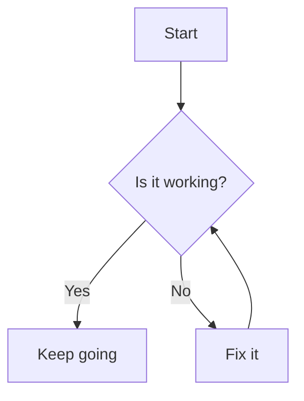
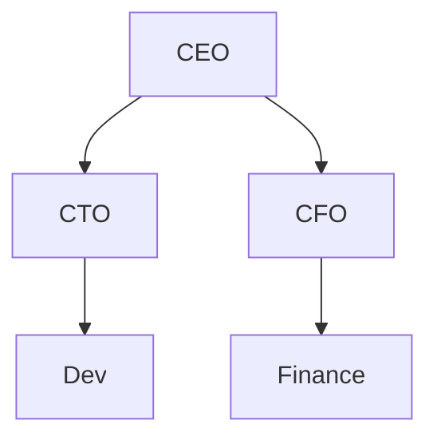

Yes — while **Mermaid** is lightweight and convenient, several alternatives offer **more expressive, interactive, or easier-to-use diagramming** capabilities, depending on your goals.

Here are the top alternatives, categorized by usability and power:

---

## 🔝 **Top Alternatives to Mermaid**

### 1. 🖼️ **Diagrams.net (formerly draw\.io)**

* **Type**: GUI-based, open-source
* **Strength**: Drag-and-drop visual editor, real-time collaboration
* **Export**: SVG, PNG, PDF, or XML
* **Use Case**: Flowcharts, architecture diagrams, org charts
* **Ease**: Very beginner-friendly

🔗 [https://app.diagrams.net/](https://app.diagrams.net/)

---

### 2. 🧠 **PlantUML**

* **Type**: Text-based (like Mermaid), but more powerful
* **Strength**: Supports class diagrams, sequence diagrams, activity diagrams, deployment diagrams, etc.
* **Syntax**: More verbose than Mermaid but also more flexible
* **Rendering**: Works with VSCode, Docusaurus, or CLI tools

🔗 [https://plantuml.com/](https://plantuml.com/)

✅ **Why it's better than Mermaid**:

* Richer diagram types (e.g., Gantt, Archimate, ER, mindmaps)
* Supports skinning/styling

---

### 3. ⚛️ **D2 (Declarative Diagramming Language)**

* **Type**: Text-based, auto-layout, real-time updates
* **Strength**: Clean syntax + powerful layouts; integrates with Markdown or CLI
* **Syntax**: Simpler and more human-friendly than Mermaid
* **Live editor**: [https://play.d2lang.com/](https://play.d2lang.com/)

🔗 [https://d2lang.com/](https://d2lang.com/)

✅ **Pros over Mermaid**:

* Cleaner syntax
* Smart auto-layout
* Supports themes and styling
* Easy for infrastructure or architecture diagrams

---

### 4. 🔵 **Graphviz / DOT**

* **Type**: Text-based
* **Strength**: Mathematical graph layouts (trees, networks)
* **Use Case**: Compiler graphs, dependency trees
* **Note**: Less user-friendly for general diagrams

🔗 [https://graphviz.org/](https://graphviz.org/)

---

### 5. 🖊️ **tldraw / Excalidraw**

* **Type**: Visual, hand-drawn-style
* **Strength**: Great for sketches and whiteboard-like collaboration
* **Use Case**: Brainstorming, casual architecture

🔗 [https://excalidraw.com/](https://excalidraw.com/)
🔗 [https://www.tldraw.com/](https://www.tldraw.com/)

---

## 🧪 Recommendation

| Use Case                       | Recommendation               |
| ------------------------------ | ---------------------------- |
| Better text-based than Mermaid | **D2** or **PlantUML**       |
| GUI-friendly & exportable      | **Draw\.io (diagrams.net)**  |
| Collaborative sketching        | **Excalidraw** or **tldraw** |

---

Great! Here's a **side-by-side comparison of Mermaid vs D2** with common diagram types to show how **D2 is often simpler and more expressive**.

---

## 🟦 Mermaid vs 🟩 D2: Syntax Comparison

### ✅ 1. **Simple Flowchart**

**Mermaid**



**D2**

```d2
A: Start
B: Is it working?
C: Keep going
D: Fix it

A -> B
B -> C: Yes
B -> D: No
D -> B
```

🔍 **D2 advantage**: Cleaner labels, no need for `graph TD` or special bracket syntax.

---

### ✅ 2. **Org Chart / Hierarchy**

**Mermaid**



**D2**

```d2
CEO -> CTO
CEO -> CFO
CTO -> Dev
CFO -> Finance
```

🔍 **D2 advantage**: No boilerplate or `graph TD` required — pure logic.

---

### ✅ 3. **Styling & Themes**

**Mermaid** has limited styling unless you use `theme` options in config.

**D2** supports clean themes and built-in layouts.

```d2
theme: cool

A: Start
B: Process
C: End

A -> B -> C
```

---

### ✅ 4. **Live Playground for Testing**

* 🟩 D2: [https://play.d2lang.com/](https://play.d2lang.com/)
* 🟦 Mermaid: [https://mermaid.live/](https://mermaid.live/)

---

## 🧩 Summary Table

| Feature           | Mermaid           | D2                |
| ----------------- | ----------------- | ----------------- |
| Syntax simplicity | Medium (brackets) | Very clean        |
| Diagram types     | Good              | Growing rapidly   |
| Themes            | Limited           | Built-in + custom |
| Auto layout       | Good              | Excellent         |
| Editor            | mermaid.live      | play.d2lang.com   |
| Self-hosting      | Yes (JS)          | Yes (Go binary)   |

---

Great! Here's how you can **embed and display D2 diagrams** in a **Flask app**, similar to how you handled Mermaid — but using D2's live rendering via client-side JavaScript.

---

## ✅ Option 1: **Using [D2.js](https://github.com/terrastruct/d2-javascript) for Browser-Based Rendering**

### 🧱 1. **Flask Directory Structure**

```
your_flask_app/
├── app.py
├── templates/
│   └── index.html
├── static/
│   └── d2.js  ← (You’ll download this)
└── diagrams/
    └── example.d2
```

---

### 🐍 2. **`app.py` (Flask Backend)**

```python
from flask import Flask, render_template
import os

app = Flask(__name__)

@app.route("/")
def index():
    diagram_folder = os.path.join(app.root_path, 'diagrams')
    diagrams = []

    for filename in os.listdir(diagram_folder):
        if filename.endswith('.d2'):
            with open(os.path.join(diagram_folder, filename), 'r', encoding='utf-8') as f:
                diagrams.append(f.read())

    return render_template("index.html", diagrams=diagrams)

if __name__ == "__main__":
    app.run(debug=True)
```

---

### 🧾 3. **`templates/index.html`**

```html
<!DOCTYPE html>
<html>
<head>
  <title>D2 Diagrams</title>
  <script type="module" src="/static/d2.js"></script>
  <style>
    .diagram-container {
      border: 1px solid #ccc;
      margin-bottom: 2rem;
      padding: 1rem;
    }
  </style>
</head>
<body>
  <h1>D2 Diagrams</h1>

  
    <div class="diagram-container">
      <d2-graph style="width: 100%;" config='{"layoutEngine": "elk"}'>
        {{ diagram }}
      </d2-graph>
    </div>
  
</body>
</html>
```

---

### 📦 4. **Get the `d2.js` Renderer**

* Download from the [D2.js GitHub Releases](https://github.com/terrastruct/d2-javascript/releases)
* Put `d2.js` (or `d2.bundle.js`) into your `/static/` folder

> Or use CDN (if available in the future), but local is safest for now.

---

### ✅ Result

When you run `app.py` and visit `localhost:5000`, all `.d2` files in your `diagrams/` folder will render dynamically using D2.js in the browser.

---

## 🧪 Bonus: Example `.d2` File

Save this as `example.d2`:

```d2
title: Sample Diagram

A: Start
B: Decision
C: Yes Path
D: No Path

A -> B
B -> C: Yes
B -> D: No
```

---

Yes, you **can attach click handlers to D2 elements** — but **not directly via the `.d2` source syntax**. Instead, you'll need to hook into the **DOM-rendered SVG elements** that D2.js outputs.

Here’s how you can do it:

---

## ✅ Approach: Use JavaScript to Add Click Handlers After D2 Renders

### 🧠 Basic Idea

Once D2 renders a diagram, it creates an SVG with `data-id` attributes on each node based on the element name in your `.d2` file.

You can then use JavaScript to find these elements and bind handlers.

---

## 🧪 Example

### 🎯 `example.d2`

```d2
A: Dashboard
B: Settings
C: Help

A -> B
A -> C
```

### 🔧 Updated `index.html`

```html
<!DOCTYPE html>
<html>
<head>
  <title>D2 with Click Events</title>
  <script type="module" src="/static/d2.js"></script>
  <style>
    .diagram-container {
      border: 1px solid #ccc;
      margin-bottom: 2rem;
      padding: 1rem;
    }
    svg text {
      cursor: pointer;
      fill: blue;
    }
  </style>
</head>
<body>
  <h1>D2 Diagrams with Click Events</h1>

  
    <div class="diagram-container">
      <d2-graph class="d2" config='{"layoutEngine": "elk"}'>
        {{ diagram }}
      </d2-graph>
    </div>
  

  <script>
    // Wait a bit to ensure D2 has rendered the diagrams
    window.addEventListener("load", () => {
      setTimeout(() => {
        // Get all rendered SVGs
        document.querySelectorAll("d2-graph").forEach(graph => {
          const svg = graph.shadowRoot.querySelector("svg");

          // Example: add click handler to nodes A, B, C
          ["A", "B", "C"].forEach(id => {
            const el = svg.querySelector(`[data-id="${id}"]`);
            if (el) {
              el.style.cursor = "pointer";
              el.addEventListener("click", () => {
                alert(`Node ${id} clicked`);
              });
            }
          });
        });
      }, 500); // Wait for D2 to finish rendering
    });
  </script>
</body>
</html>
```

---

## 🧩 Notes

* `data-id="A"` corresponds to the node `A` in your D2 source.
* You can style or interact with any node/edge via these `data-id`s.
* D2 does not expose a public event API yet — this is **DOM-level binding**.

---

Would you like to:

* Trigger navigation or modal popups instead of `alert()`?
* Dynamically generate diagrams with links based on database content?
